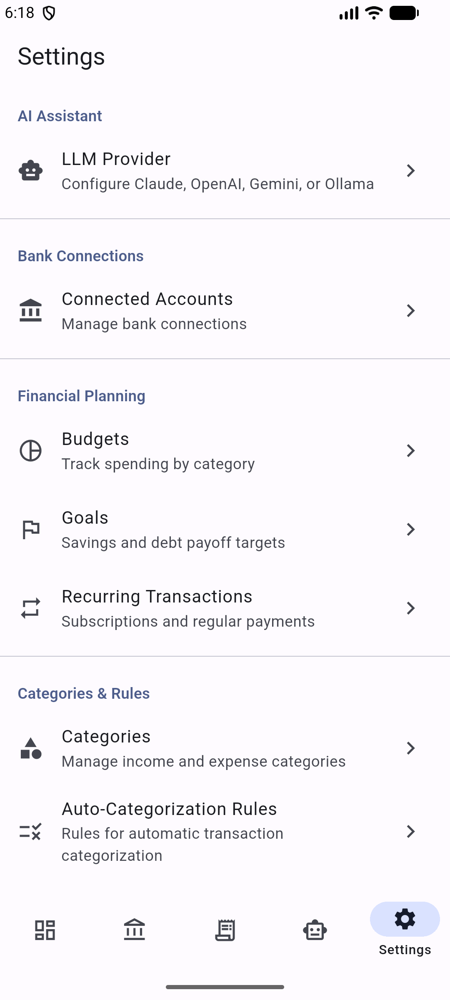

<p align="center">
  
</p>

# Money Money

[](https://sladge.net)

A personal finance management app built with Flutter, featuring local-first data storage, AI-powered insights, and bank connectivity.

## Features

- **Adaptive App Icon** — Proper Android adaptive icon with foreground/background layers
- **PIN Security** — PBKDF2-HMAC-SHA256 hashed PIN with auto-lock on backgrounding
- **Accounts** — Track 18 account types (checking, savings, credit card, investment, etc.) with full CRUD
- **Transactions** — Record income and expenses with category tagging, filtering, and search
- **Dashboard** — At-a-glance summary with charts (fl_chart) showing balances, spending trends, and recent activity
- **Categories** — 16 expense and 7 income parent categories with subcategories, seeded on first launch
- **Bank Connectivity** — SimpleFIN integration with multi-login support, automatic account sync
- **CSV Import** — Column mapping, preview, and import history
- **Budgets** — Budget tracking with category-based spending limits
- **Goals** — Financial goal tracking with progress monitoring
- **Retirement Projections** — Monte Carlo simulation with percentile bands, configured via AI-powered conversational interview
- **Recurring Transactions** — Automatic detection of recurring income and expenses
- **Auto-Categorization** — Two-tier system with 300 default merchant rules and learned mappings from manual assignments
- **AI Assistant** — Natural language interaction for insights and automated parameter extraction (Retirement, Budgeting)
- **Data Export** — CSV export for accounts and transactions
- **Material 3 Theming** — Dynamic color support with semantic finance colors (income=green, expense=red)
- **Offline-First** — All data stored locally in SQLite via Drift ORM

## Screenshots

<p align="center">
  
  
  
  
  
</p>

<p align="center">
  <em>Dashboard &bull; Accounts &bull; Transactions &bull; AI Assistant &bull; Settings</em>
</p>

## Platforms

- Android
- Linux desktop

> Web builds are not supported due to a `dart:ffi` dependency (sqlite3).

## Architecture

Clean Architecture with three layers:

```
lib/
├── core/          # Constants, DI (Riverpod), extensions, routing (GoRouter), theme
├── data/          # Drift database, repositories, secure storage
├── domain/        # Use cases, business logic, auth
└── presentation/  # Screens, providers, shared widgets
```

**State Management**: Manual Riverpod providers (not riverpod_generator).
**Database**: Drift with 21 tables — money as integer cents, UUIDs for PKs, Unix ms for timestamps.
**Routing**: GoRouter with `StatefulShellRoute.indexedStack` for 5-tab bottom navigation.

See [CLAUDE.md](CLAUDE.md) for detailed architecture documentation, build commands, and development conventions.

## Status

```bash
# Install dependencies
flutter pub get

# Run code generation (Drift)
dart run build_runner build --delete-conflicting-outputs

# Run the app
flutter run

# Run tests
flutter test

# Build release APK
flutter build apk --release
```

## Project Status

| Phase | Status | Description |
|-------|--------|-------------|
| Phase 1 — Foundation | Complete | Database, auth, theme, repositories, routing, settings |
| Phase 2 — Accounts & Transactions | Complete | Accounts CRUD, transactions CRUD, dashboard, category picker |
| Phase 3 — Bank Connectivity | In Progress | SimpleFIN sync, CSV import, budgets, goals, recurring detection, auto-categorization, AI assistant, retirement projections (Monte Carlo), and architecture hardening (0.3.14) complete. Remaining: auto-categorization management UI, Supabase sync, OFX import |

## Dev Data Seeder

In debug builds, the app automatically seeds 7 accounts and ~150 transactions on first launch, giving the dashboard, accounts, and transactions screens realistic data to work with. The seeder is idempotent — it only runs when no accounts exist.

**Seeded accounts:** Primary Checking (Chase), Emergency Savings (Ally), Rewards Credit Card (Chase), Roth IRA (Fidelity), 401k (Fidelity), Auto Loan (Capital One), Brokerage (Robinhood).

**Transactions** span 4 months of checking, credit card, and savings activity (groceries, gas, dining, subscriptions, transfers, etc.). Categories are assigned automatically by the auto-categorization rules that run immediately after seeding.

To verify:
1. Uninstall the app (or clear app data) to start fresh
2. Run `flutter run` (debug mode)
3. Dashboard should show ~$137k net worth, cash flow chart, and recent transactions
4. Accounts screen shows 7 accounts with balances
5. Transactions screen shows ~150 categorized transactions
6. Second launch skips seeding (accounts already exist)

The seeder is gated behind `kDebugMode` and does not run in release builds.

## Development Guidelines

Development conventions, testing patterns, performance guidelines, and deployment checklists are documented in [CLAUDE.md](CLAUDE.md). Key points:

- All money values are **integer cents** (never floating point)
- Expenses are stored as **negative** `amountCents`
- Use `flutter analyze` to check for lint issues before committing
- Run `dart run build_runner build --delete-conflicting-outputs` after changing Drift table schemas

## Acknowledgments

Flutter development guidelines in this project were informed by [flutter-claude-code](https://github.com/cleydson/flutter-claude-code) by [@cleydson](https://github.com/cleydson) — a comprehensive Flutter development ecosystem with specialized agent patterns covering architecture, testing, performance optimization, security, API integration, and deployment best practices.
