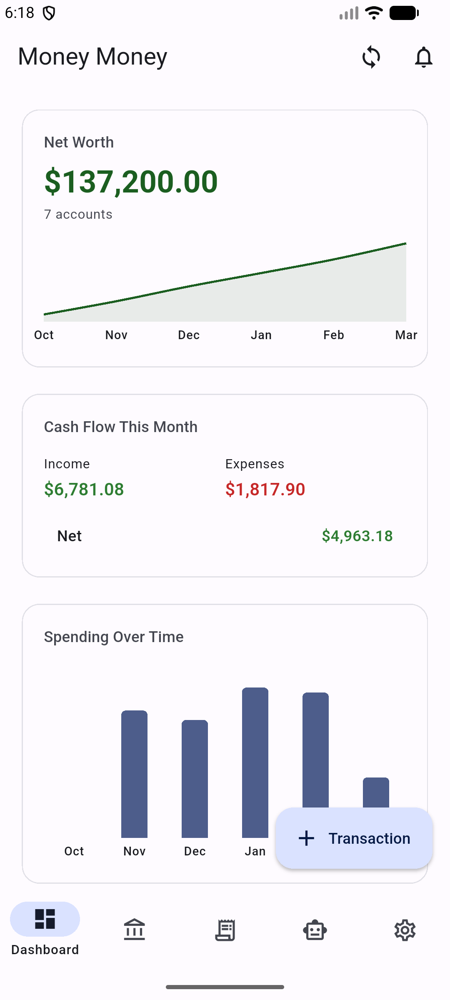
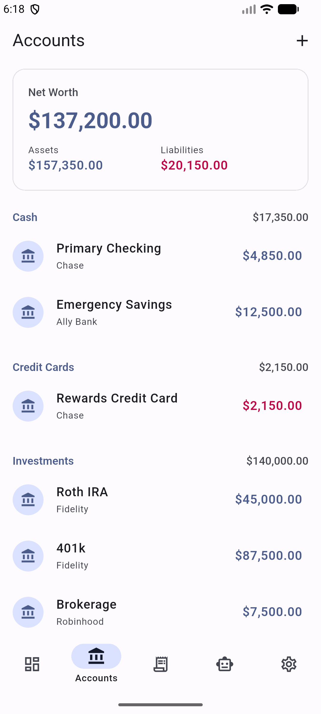
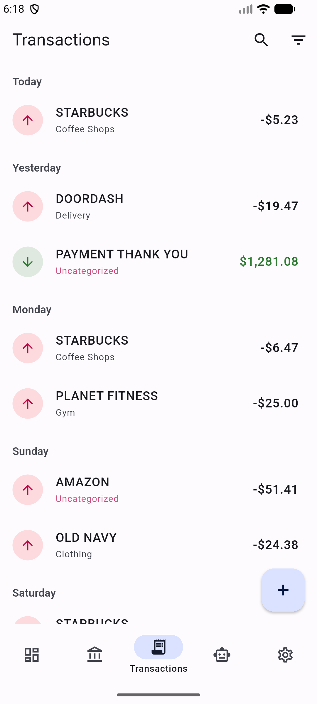
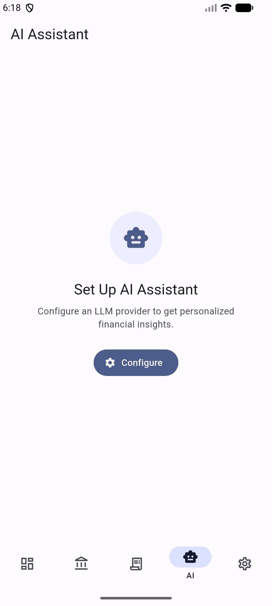

<p align="center">
  
</p>

# Money Money

[](https://sladge.net)

A personal finance management app built with Flutter, featuring local-first data storage, AI-powered insights, and forward-looking financial guidance.

All your data stays on-device in a local SQLite database. The optional AI assistant uses a bring-your-own-key model — you choose the provider and control what gets sent. Targets Android and Linux desktop.

## Screenshots

<p align="center">
  
  
  
  
  
  
</p>

<p align="center">
  <em>Dashboard &bull; Charts &bull; Edit Mode &bull; Accounts &bull; Transactions &bull; AI Assistant</em>
</p>

## Features

### Customizable Dashboard

13 cards covering health score, net worth, spending analytics, budgets, forecasting, and more. Drag-to-reorder in edit mode, show/hide individual cards, and toggle card size (full/half width on desktop). Layout persists across app restarts. Cards with no relevant data hide automatically. Responsive layout — single column on phone, multi-column on desktop.

### Accounts & Transactions

Track 18 account types: checking, savings, credit cards, brokerage, 401(k), IRA, Roth IRA, HSA, mortgage, auto loan, student loan, personal loan, line of credit, real estate, vehicle, crypto, and other assets/liabilities. Full transaction management with category tagging, filtering, and search. CSV import with column mapping and CSV export.

### Categories & Auto-Categorization

17 expense and 7 income parent categories with subcategories, seeded on first launch. Two-tier auto-categorization: 326 default merchant-to-category rules plus learned mappings from your manual category assignments.

### Bank Sync

[SimpleFIN](https://www.simplefin.org/) integration with multi-login support for automatic account and investment holdings sync. Recurring transaction detection and background sync (Android WorkManager; in-process on Linux).

### Budgets & Goals

Budget tracking with category-based spending limits and AI-powered budget suggestions. Financial goal tracking with progress monitoring.

### Financial Planning

Debt payoff planner comparing snowball vs avalanche strategies with interest savings calculation and per-debt payoff timelines. Retirement projections via Monte Carlo simulation with percentile bands, configured through an AI-powered conversational interview. Loan amortization schedules.

### Analytics & Forecasting

Financial health score (0–100 from 6 weighted pillars: emergency fund, debt-to-income, savings rate, budget adherence, net worth trend, retirement readiness) with a priority ladder telling you what to focus on next. Cash flow forecasting projects balances 30/60/90 days forward using recurring transactions and flags upcoming low-balance dates. Savings rate trends, category spending analytics, and smart alerts for budget thresholds, upcoming bills, and spending anomalies.

### AI Assistant

Natural language chat for financial questions and AI-generated insights surfaced in a dedicated Insights tab. Supports 4 LLM providers: Gemini (Google), Claude (Anthropic), OpenAI, and Ollama (local/self-hosted). BYOK — you provide your own API key in Settings.

### Security

PIN authentication (PBKDF2-HMAC-SHA256, 256k iterations) with optional biometric unlock and configurable auto-lock on backgrounding. Credentials stored via Android Keystore / Linux libsecret. Google Drive backup & restore for your database.

### Theming

Material 3 with dynamic color support. Light, dark, and AMOLED black modes with semantic finance colors (income = green, expense = red).

## AI & Data Privacy

The AI assistant provides natural language chat and dashboard insights by sending a snapshot of your financial data to your configured LLM provider. Here's exactly what it sees.

### Data sent to the LLM (each message or insight request)

- **Account names, types, and balances** (top 10 by balance) — e.g., "Primary Checking (checking): $5,234.00"
- **Net worth total**
- **Recent 20 transactions** with date, payee name, and amount — e.g., "3/15 AMAZON: -$45.99"
- **Top 10 spending categories** with 30-day totals — e.g., "Groceries: $456.00"
- **Active budgets** with category name and per-period limit
- **Active goals** with name, current/target amounts, and retirement details (year, monthly contribution) if applicable
- **Monthly savings rate** percentage

### Data never sent

Sensitive credentials — bank logins, SimpleFIN tokens, your PIN, biometric data, and API keys for other services — never leave the device. Transaction IDs, internal database identifiers, raw CSV files, and full transaction history are also never sent.

### How it works

- **BYOK (Bring Your Own Key)** — the app ships with no bundled API key. You configure your own provider and key in Settings.
- **4 supported providers**: Gemini (Google), Claude (Anthropic), OpenAI, Ollama (local/self-hosted)
- **Context is rebuilt fresh** each conversation turn from your local database — the app does not maintain server-side state.
- **All chat history stays local** in the on-device SQLite database. The app does not store conversations on any server.
- **Fully local option**: Ollama enables inference with no data leaving your device (requires a separate Ollama server).

See the full [Privacy Policy](docs/privacy-policy.md) for more detail.

## Platforms

- Android
- Linux desktop

> Web builds are not supported due to a `dart:ffi` dependency (sqlite3).

## Getting Started

### Prerequisites

- **Flutter 3.38+** (Dart SDK ^3.10.8)
- **Android SDK** for Android builds
- **Linux**: `libsecret-1-dev` and `libjsoncpp-dev` for secure storage

### Building from Source

```bash
# Install dependencies
flutter pub get

# Run code generation (required before first build)
dart run build_runner build --delete-conflicting-outputs

# Run the app
flutter run

# Run tests
flutter test

# Build release APK
flutter build apk --release
```

## Architecture

Clean Architecture with three layers:

```
lib/
├── core/          # Constants, DI (Riverpod), extensions, routing (GoRouter), theme
├── data/          # Drift database, repositories, secure storage, LLM clients
├── domain/        # Use cases and business logic
└── presentation/  # Screens, providers, shared widgets
```

**State Management**: Manual Riverpod providers.
**Database**: Drift ORM with 21 SQLite tables.
**Routing**: GoRouter with 5-tab bottom navigation (Dashboard, Accounts, Transactions, AI, Insights).

See [CLAUDE.md](CLAUDE.md) for detailed architecture documentation, build commands, testing patterns, and development conventions.

## Known Limitations

- **No iOS support** — Android and Linux desktop only
- **No cloud sync** — all data is local (planned for future)
- **Linux background sync** runs only while the app is open (Android uses WorkManager for true background sync)

## Contributing

Development conventions, testing patterns, performance guidelines, and deployment checklists are documented in [CLAUDE.md](CLAUDE.md).

## Acknowledgments

Flutter development guidelines in this project were informed by [flutter-claude-code](https://github.com/cleydson/flutter-claude-code) by [@cleydson](https://github.com/cleydson) — a comprehensive Flutter development ecosystem with specialized agent patterns covering architecture, testing, performance optimization, security, API integration, and deployment best practices.
